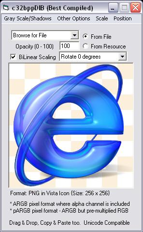



## LaVolpe 32bpp DIB Suite \[16Feb09\]

### Description

Updatd to fix 2 logic errors. Enclosed is a suite of classes that allow you to work strictly with 32bpp DIBs, including recognizing transparency/alpha channels in gifs, icons, pngs, tga &amp; bitmaps. There are a bunch of "nice to have" routines and maybe an eye-opener or two for some of you. The classes are heavily commented. 18Feb08. Added text support &amp; tiling. 9Mar08: Added TGA read/write, save as JPG, added Paul Caton's revised CDECL thunks for safer zlib usage, updated sample form. Review Change History in the RTF file for important notes &amp; overview of class functions/properties. Most recent changes: Manually parsing grayscale PNGs can fail to correctly parse transparency, and the icon parser could fail to recognize some transparency in the icon mask.
 
### More Info
 

             |
---                |---
**Submitted On**   |2009-02-16 20:35:34
**By**             |[LaVolpe](https://github.com/Planet-Source-Code/PSCIndex/blob/master/ByAuthor/lavolpe.md)
**Level**          |Advanced
**User Rating**    |5.0 (344 globes from 69 users)
**Compatibility**  |VB 6\.0
**Category**       |[Graphics](https://github.com/Planet-Source-Code/PSCIndex/blob/master/ByCategory/graphics__1-46.md)
**World**          |[Visual Basic](https://github.com/Planet-Source-Code/PSCIndex/blob/master/ByWorld/visual-basic.md)
**Archive File**   |[LaVolpe\_322144152162009\.zip](https://github.com/Planet-Source-Code/lavolpe-lavolpe-32bpp-dib-suite-16feb09__1-67466/archive/master.zip)

